# Examining Media Coverage of Climate Change

## Introduction

Media coverage on societal issues play a large role in shaping public opinion.  As seen in today’s “fake news” phenomenon, how citizens perceive the news can have wide reaching effects throughout the world.  In the past few decades, climate change has been a very divisive issue in the United States.  Based on polling conducted by Gallup, public opinion on climate change has often been nearly evenly split on either sides of the issue.

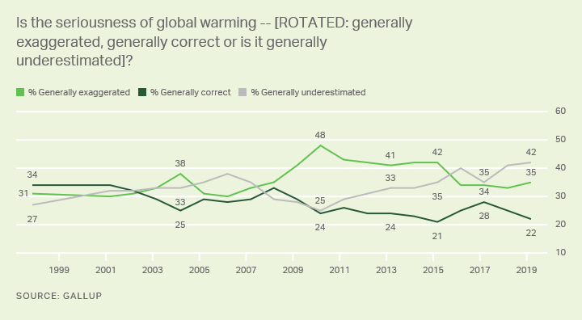
 
[Source](https://news.gallup.com/poll/1615/environment.aspx)

In this survey conducted by Gallup in the United States, optimism surrounding the issue of climate change is measured.  In general, the amount of people who believe that public discourse on climate change is underestimated has been increasing over the last two decades.  This can also be interpreted as people becoming more pessimistic about this subject, as climate change becomes a more pressing issue that is not being addressed.  [Public polling](https://news.gallup.com/poll/206030/global-warming-concern-three-decade-high.aspx) on the subject of climate change has been robust, and generally show that people are indeed becoming more pessimistic on the subject, especially as the effects of climate change have become more apparent in day to day life.

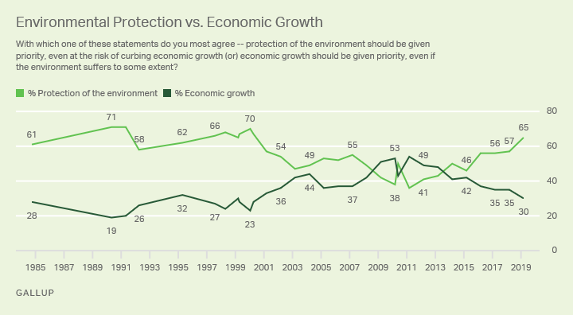

[Source](https://news.gallup.com/poll/1615/environment.aspx)

Polls such as these demonstrate the importance that other societal issues play in the discussion of climate change. In the poll above, economic conditions of the country is pitted against the interest of protecting the environment.  This raises the question: how do our news sources present this balance of issues?  If economic issues are important to Americans, does news coverage of climate change incorporate economics as well?  How do Americans’ concern for the economy reflect itself in the news?

The goal of this research is to examine how news coverage of this issue has changed over the years, and potentially how this would correlate to public opinion over the years.  This will be achieved through textual analysis of news articles about climate change from the past two decades.  First, the optimism expressed in news articles will be determined, and compared with public opinion polling.  In addition, two topics within these articles were chosen for closer examination: the politics and economics surrounding climate change.  These two topics were chosen because they are heavily reported topics in mainstream media, which makes them interesting candidates to study in relation to the topic of climate change.
  
## Research Question

How has media coverage of climate change evolved over the years, in terms of optimism and topic choice (politics and economics)?

## Methodology

There are two keys to answering this research question: sentiment analysis and article classification.  Sentiment analysis will be used to determine the optimism expressed in an article, while article classification will be used to determine the purpose and topics in an article.  These methods will be applied to a collection of news articles.

There are examples of studies that examine media discourse of climate change.  [One study](https://www.sciencedirect.com/science/article/pii/S0959378008000940) uses a “discourse analysis” framework to determine how climate change is portrayed in newspaper articles.  The five categories of discourse were pre-determined to be optimism, rationalism, ethical mitigation, crisis, and opportunity.  This study is similar to the sentiment analysis that will be performed to determine optimism.  However, the researchers did not use textual analysis methods to classify their articles, which resulted in a very small dataset (150 articles).  The research was much more focused on qualitative assessment of news coverage.  For this research, sentiment analysis using dictionary methods will be used instead.

Other [studies](http://rockyanderson.org/wp-content/uploads/2016/04/MediacoverageofCC-current-trends.pdf) have attempted to determine how climate change is framed by corporate media.  Just like the previously mentioned study, this also does not use textual analysis methods.  In summary, the media has been rather consistent with its messaging on climate change over the years.  This issue has been kept alive throughout the years, even when public opinion has fluctuated.  However, according to the study, media coverage has been “limited the extent to which real change in the organization of society and foreign assistance have been called for.”  In other words, the press has been conservative with its messaging when scientific projections call for structural or revolutionary change.  Even though this article delves into large scale social issues in corporate media, the line of reasoning used for their analysis will be useful for this research.

### Dictionary Method

Dictionary methods are a good way of performing [sentiment analysis](http://ceur-ws.org/Vol-1743/paper9.pdf).  This method uses predefined dictionaries to categorize texts.  Categories can be split by topic, sentiment, or tone.  Therefore, dictionary methods work best when these categories are well defined, and a dictionary exists which codifies these categories.  These predetermined dictionaries are manually coded by humans, which identifies words and their associated categories.  Articles are then categorized based on the frequency that words appear in each category.  Using a dictionary method has a similar outcome as creating a supervised learning model.  However, while a supervised learning model requires large amounts of data for the training set, dictionary models can be employed with a small number of documents.  

Dictionary methods are context invariant, which means that words are weighted the same regardless of the context of their documents.  The [problem](https://onlinelibrary.wiley.com/doi/abs/10.1111/j.1540-6261.2010.01625.x) with this is that a provided dictionary cannot ensure that the words are accurate within the context of the actual documents.  However, as the purpose of this research is to categorize the optimism of the articles, using a dictionary is appropriate, as well established dictionaries with this classification already exist.  The [qdap dictionary](https://cran.r-project.org/web/packages/qdapDictionaries/qdapDictionaries.pdf) in R will be used to classify documents by their positivity/negativity, which is an effective measurement of optimism.

### Supervised Learning Method

In addition to using dictionary methods to classify the documents, a supervised learning model will be developed to further classify the documents by topic and purpose.  A supervised learning model is used, because the categories used by the model will be predefined (political and economic articles).  Therefore, there is no need to for any sort of topic discovery.

The process of developing a supervised learning model requires for a training data set to be code manually first.  This data set is then used to train a model to classify articles into the predetermined categories.  For the most part, supervised learning models utilize the bag of words method, which is a very simple way of extracting features from text.  In essence, documents are reduced down to their individual words, or “tokens”.  The tokens can be counted and converted into a vector format, such as a Document Term Matrix (DTM).  These matrices represent how often each term, or token, appear in a certain document.  This data structure is used by machine learning algorithms to develop classifier models.

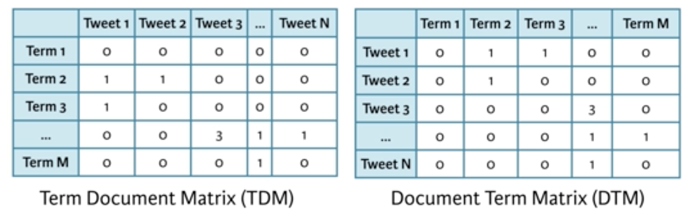

[Source](https://rpubs.com/williamsurles/316682)

To develop a supervised learning model for this research, a portion of the collected news articles will need to be manually coded for the two categories: political and economic.  A lot of this process comes down to manual judgement, as sometimes it can be hard to tell if an article is “focusing” on the political issues involved with climate change.  The key was to remain consistent throughout the process.

## Collecting the Data

News articles containing the phrase “climate change” were collected from the New York Times over the years 2000-2019.  There are a multitude of terms to describe this phenomenon, such as “global warming” or “climate crisis”.  Ultimately, the phrase “climate change” was used as it is currently the most accepted term to describe the phenomenon.  The number of articles containing the phrase “climate change” is already very large, so collecting additional data did not seem necessary.

The news articles were collected using the [New York Times public developer API](https://developer.nytimes.com/docs/articlesearch-product/1/overview).  This API was used because it provides keyword search functionality that returns the locations of all articles containing certain keywords

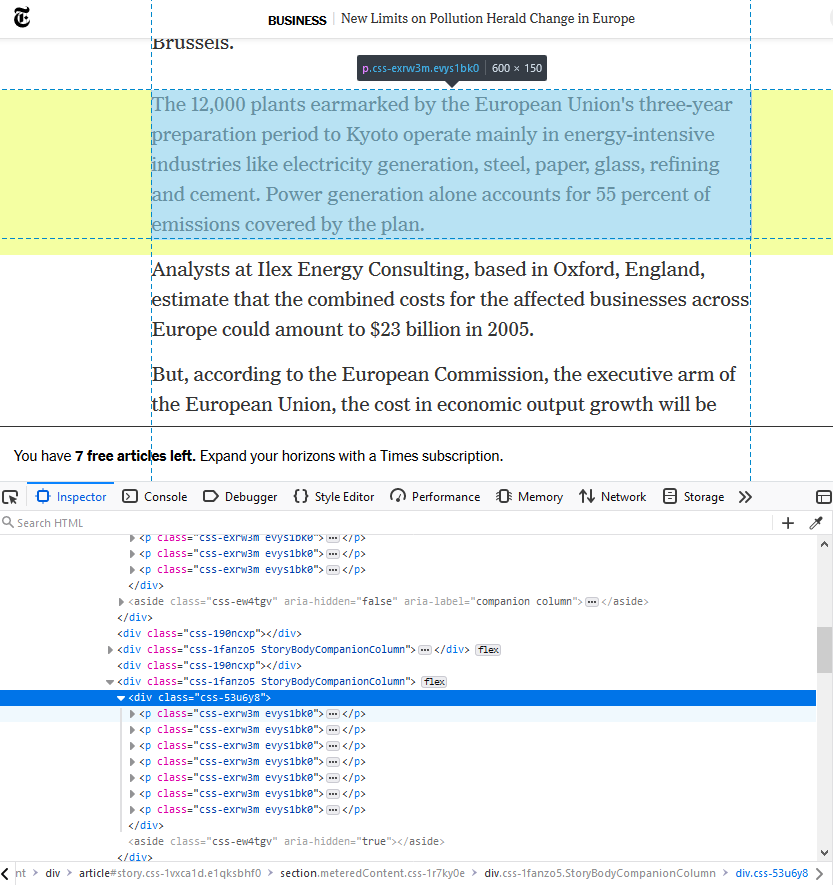

The collected URLs to articles were then used to web scrape the New York Times website for full texts of articles.  The New York Times website provides uniform formatting for all articles through the years, making web scraping a simple and efficient process of acquiring large amounts of data.

The following code snippet was used to query the New York Times API, web scrape the retrieved HTML for the full news article content, and finally save the collected articles into CSV format for safe keeping.

```markdown
library(jsonlite)
library(magrittr)

getYears <- function(start_year, end_year) {
  term <- "climate+change" # Need to use + to string together separate words
  begin_date <- paste0(start_year, "0101")
  end_date <- paste0(end_year, "0101")

 
  baseurl <- paste0("http://api.nytimes.com/svc/search/v2/articlesearch.json?q=",term,
                    "&begin_date=",begin_date,"&end_date=",end_date,
                    "&facet_filter=true&api-key=", apikey, sep="")
  initialQuery <- fromJSON(baseurl)
  maxPages <- round((initialQuery$response$meta$hits[1] / 10)-1)
 
  pages <- list()
  for(i in 0:maxPages) {
    possibleError <- tryCatch(
      nytSearch <- fromJSON(paste0(baseurl, "&page=", i), flatten = TRUE) %>% data.frame(),
      error = function(e) e
    )
    if(!inherits(possibleError, "error")) {
      
      message("Retrieving page ", i)
      pages[[i+1]] <- nytSearch
    }
    Sys.sleep(2)
  }
 
  allNYTSearch <- rbind_pages(pages)
  library(dplyr)
  allDocs <- select(allNYTSearch, response.docs.pub_date, response.docs.web_url)
 
  library(rvest)
 
  fullTexts <- vector()
  dates <- list()
 
  allDates <- allDocs$response.docs.pub_date
  allUrls <- allDocs$response.docs.web_url
  for (i in 1:length(allUrls)) {
    print(paste0("Retrieving document ", i))
    possibleError <- tryCatch(
      doc <- read_html(allUrls[i]),
      error = function(e) e
    )
    if(!inherits(possibleError, "error")) {
      results <- doc %>% html_nodes(".css-exrw3m.evys1bk0")
      article <- ""
      for (j in 1:length(results)) {
        article <- paste(article, toString(xml_contents(results[j])))
      }
      
      dates <- c(dates, allDates[i])
      fullTexts <- c(fullTexts, article)
    }
  }
 
  matrix <- do.call(rbind, Map(data.frame, dates=dates, text=fullTexts))
  write.csv(matrix, paste0(start_year, ".csv"))
}

cleanHtml <- function(htmlString) {
  return(gsub("<.*?>", "", htmlString))
}
```
Notes: a few web scraped articles had to be “cleaned” of HTML tags, as some articles did have irregular content formats

## Processing the Data
  With the news articles stored as raw text, the next step was to build a corpus of documents to perform analysis on.  A few steps were taken to clean the data: standardizing to lowercase letters, removing stop words, stripping whitespaces, removing punctuation, and stemming.  The stop words removed are defined in the ‘tm’ R library.
  
```markdown
library(tm)

corpus <- Corpus(VectorSource(fullTexts))
tm_map(corpus, function(x) iconv(enc2utf8(x), sub = "byte"))

# standardize to lowercase
corpus <- tm_map(corpus, content_transformer(tolower))
# remove tm stopwords
corpus <- tm_map(corpus, removeWords, stopwords())
# strip whitespaces
corpus <- tm_map(corpus, stripWhitespace)
# remove punctuation
corpus <- tm_map(corpus, removePunctuation)
```
Next, document term matrices were built for use with the supervised learning model algorithms.

```markdown
dtm <- DocumentTermMatrix(corpus)
tdm <- TermDocumentMatrix(corpus)
```

### Coding a Training Set
A subset of the dataset was manually coded for the two categories as demonstrated below.  Each article was read, and the presence of a topic was judge manually.

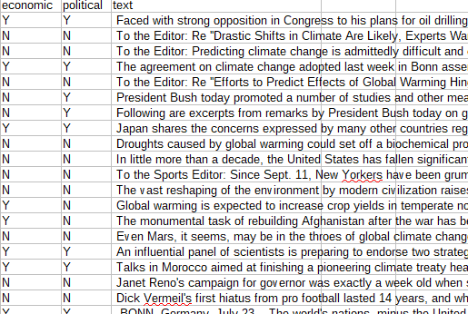

Due to the difficulty and tediousness of manually coded long articles, a total of 50 articles were coded.  The articles were chosen at random from the dataset, in order to get a wide range of scenarios.  These 50 articles will be used for training and validation of the supervised learning model.

## Developing the Supervised Learning Model

To quantify the effectiveness of the model, some useful [metrics](https://developers.google.com/machine-learning/crash-course/classification/true-false-positive-negative) should be defined first. Accuracy, precision, and recall are all metrics that can be used to assess the effectiveness of how a supervised learning model makes predictions.  Accuracy is simply a measure of how often a model is able to make a correct prediction.  It is measured as a ratio of the number of correct predictions and the total number of predictions made. Precision, on the other hand, is a measure of the proportion of positive identifications that were actually correct.  In other words, it is the ratio of true positive predictions and the total number of positive predictions.  Recall is a similar metric, but instead measures the proportion of actual positives that were identified correctly.  It is the ratio of true positives and the total number of all true positives.

Accuracy is a more general metric, but should not be used to determine effectiveness in situations where it is critical to avoid incorrect classifications.  Precision is a better metric when it is important to avoid false positives.  For example, when developing a spam filter, a false positive would be a real email being identified as spam, which is not an acceptable outcome.  Recall is best used in the opposite situation, when it is important to avoid false negatives, such as in a medical diagnosis situation.  A patient that is actually sick should never be classified as negatively (not sick).  However, for the purposes of this research, avoiding incorrect classifications is not a major risk.  Therefore, accuracy will be the primary metric used to determine the effectiveness of the model.

The first attempt at developing a supervised learning model was creating a Naive Bayes classifier using the ‘e1071’ R library.

```
library('e1071')
fit <- naiveBayes(cat~., data=df.train, kernel="linear")
```

To determine the effectiveness of the model, a basic hold out cross validation was performed using the reserved test set.  Out of the 50 coded articles, 30 were randomly chosen to be in the training set, while the remaining 20 were used for validating the model.  The results were very poor, with no true positive results at all.  When faced with new data that the model has never seen before, the model is unable to classify the negative label.  Based on this trend, the Naives Bayes model is useless at categorizing the purpose of the articles, with the current preprocessing.

**Naives Bayes - Political Label**

|            | Y (Predicted) | N (Predicted) |
|------------|---------------|---------------|
| Y (Actual) |       12      |       0       |
| N (Actual) |       8       |       0       |

The second attempt was creating a Support-Vector Machine classifier (SVM), using the same training set as the Naive Bayes model.  No preprocessing of the data was changed.  Using the same cross validation method, the results were much better, with a nearly perfect result.  Though the size of training and testing set was not very large, this simple cross validation still shows that this model is more capable of classifying my documents than the Naives Bayes model.

**SVM - Political Label**

|            | Y (Predicted) | N (Predicted) |
|------------|---------------|---------------|
| Y (Actual) |       11      |       1       |
| N (Actual) |       8       |       8       |

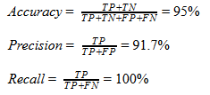


Because of the very high accuracy (95%) of this SVM model, it is determined that the model was actually able to classify the ‘political’ label well.  An additional round of simple validation was performed using the ‘economic label’.

**SVM - Economic Label**

|            | Y (Predicted) | N (Predicted) |
|------------|---------------|---------------|
| Y (Actual) |       8       |       1       |
| N (Actual) |       2       |       9       |

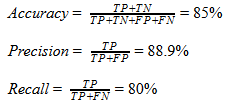

Again, the results were similar to the ‘political’ label prediction, with only slightly less accurate results (85% accuracy).  With these two coded labels cross validated, the effectiveness of this SVM model is assessed to be fairly good.  The SVM model ended being the learning model that is used to classify the entire data set.

## Results

### Sentiment Analysis

Using the ‘SentimentAnalysis’ library in R, each article in the corpus is scored on a scale of positivity/negativity, with a score of 0 being completely neutral.  An article with a positive score is considered to be ‘optimistic’, while a negative score is ‘pessimistic’.  Below is a sample categorization of the articles from the year 2001. 

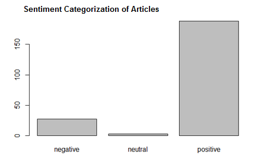

Throughout the years, the vast majority of articles were scored above 0, meaning the qdap dictionary defines these articles as optimistic.  Despite the fact that most articles fall into the same “category” of articles, there is still a way to quantify the trends in optimism using the sentiment scores.  That is the usefulness of this type of sentiment analysis.  Below are the sentiment values for the entire dataset.

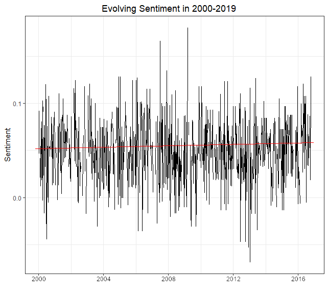

There was very little change in sentiment throughout the nearly two decades worth of news coverage.  In general, articles remained positive (sentiment value above 0), and relatively uniform.  The regression line shows a very slight increase in optimism, but is fairly negligible.  The data does not reflect the trend expressed in the original Gallup polls, which showed decreasing optimism through the years.  Even zooming in on noteworthy events in history, such as the global recession in 2008, showed no trends in sentiment.  Therefore, it is safe to say that sentiment scores throughout the two decades have not had any meaningful trends.

The most obvious explanation for this lack of change comes from the source of the data.  By nature, trustworthy publications are supposed to be as neutral and unbiased as possible.  The New York Times is a relatively well trusted source of news, which means their news articles should reflect this neutral nature, without conveying a sense of positivity or negativity.

Additionally, because the documents are all news articles, which report on real life events, one could expect the documents to have little opinionated content.  Optimism is more clearly expressed in opinionated content, which results in the small variance seen from the sentiment analysis.  This unfortunately means that performing sentiment analysis to determine optimism in the news articles did not result in any meaningful insights.

### Political Topic Classification

The SVM model was applied to the entire span of articles collected (2000 - 2019).  The average percentage of articles containing discussion of politics was calculated for each year individually.  First, the topic of politics was examined.  Given the nature of political news coverage, included in the plot are markers for the US presidential election years, as one could expect an increase of discussion of politics during election years.

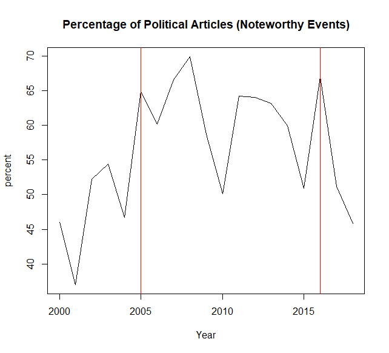

Even though the resolution of the analysis is fairly low, there does appear to be spikes on election years, especially in the year 2008 and onward.  This could reflect increases in discussions about climate policy when reporting on presidential candidates.  However, given that the US Presidential elections are not the only noteworthy political events that have occurred, it may be useful to look at other sources of spikes in the graph.

Within the time span being analyzed, there were two particularly significant events in the world of climate politics.  The first event was the enactment of the Kyoto Protocol in 2006.  When exploring the data initially, the topic of the Kyoto Protocol appeared a lot.  Even though the Kyoto Protocol was first signed in 1997, there was continued discussion of the agreement for years to come, because the United States had refused to join the agreement.  There were many articles reporting on the Bush administration’s response to public pressure to join the agreement.  Building a word cloud using the articles from the year 2005, one can see how that the term “kyoto” appears very frequently, as it is one of the more substantial words near the center of the cloud.  A lot of the more common words or not particularly relevant to the topic of climate change.

```
set.seed(02138)
m <- as.matrix(tdm)
v <- sort(rowSums(m),decreasing=TRUE)
d <- data.frame(word = names(v),freq=v)
head(d, 10)

library("wordcloud")
wordcloud(words = d$word, freq = d$freq, min.freq = 1,
          max.words=200, random.order=FALSE, rot.per=0.35,
          colors=brewer.pal(8, "Dark2"))
```

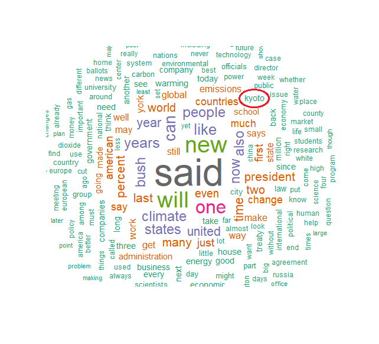

The second noteworthy event in this time span is the signing of the Paris Climate Accord in 2016.  A word cloud analysis was also performed for this year, but the climate accord did not appear significantly in the cloud, mostly overpowered by the eventful presidential election of that year.  Briefly looking at the occurrences of the term ‘climate change’, one can see the spike in mentions during late 2015 to early 2016, which was when the agreement was being drafted in Paris.

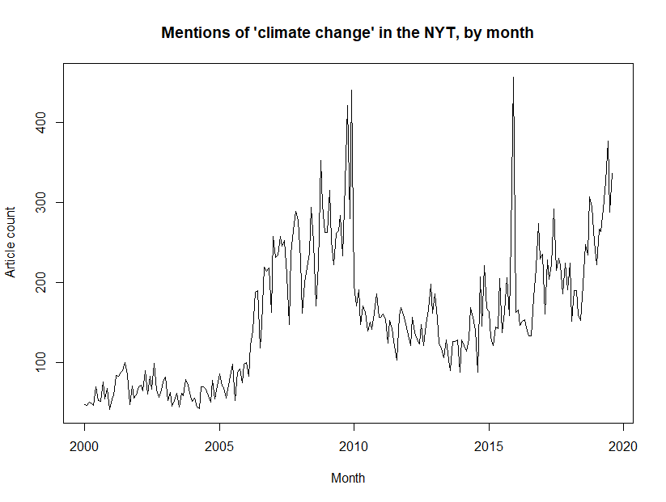


With these two landmark events in mind, the plot once again shows spikes in the two years.  This only shows that there is a focus on climate politics whenever a relevant political event is ongoing.  As noted above, the abrupt spike 2016 may not be an accurate representation because of the ongoing presidential election.  But with these insights, one can conclude that political discussions about climate change is largely dependent on newsworthy events that occur.  When there are large political events involving climate change, news coverage of the issue will also follow suit.

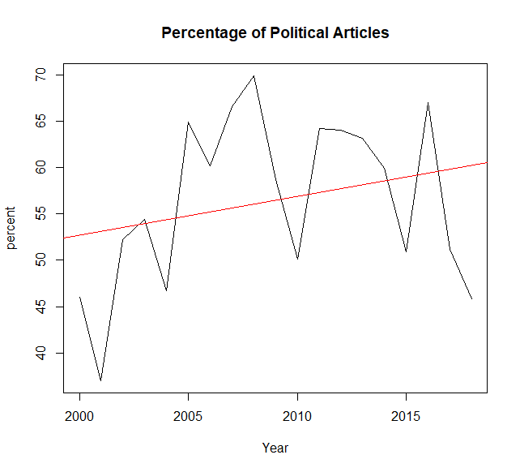

A simple linear regression of the data shows a mild increase in political discussions over the two decades, though it was not a significant increase.   However, this increase does match the increase in urgency over climate change found in the Gallup polls.  Logically, as Americans become more concerned with climate change and its effects, there will be more discussion about the political solutions to this problem.  The trend seen in this dataset does support this theory.

#### Economic Topic Classification

The same classification methodology was performed using the SVM model for the economic topic.  This resulting trends are shown below.

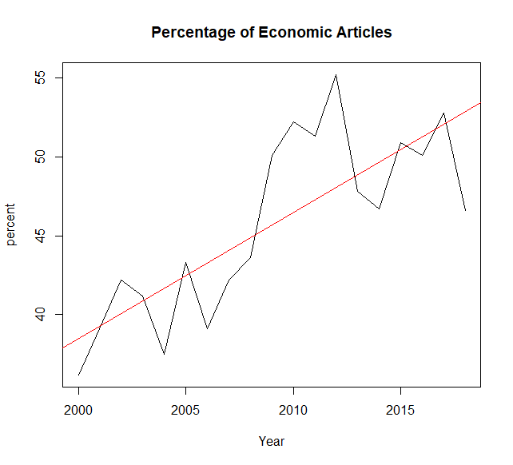

Unlike the regression plot for the political topic, the economic topic regression line clearly shows an increase in discussion about the economics of climate change.  Using the same line of analysis as the political model, it may be interesting to examine noteworthy economic events around this time.  The most obvious choice would be the global recession which started in 2009.

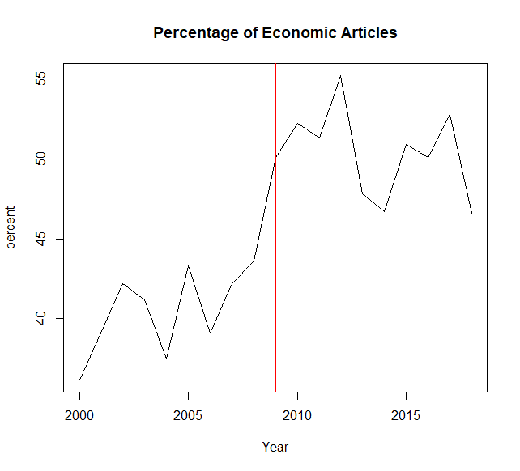

Interesting enough, it appears that there is a significant increase in economic articles after 2009.  After 2009, the percentage never returns to pre-2009 levels.  Apparently, after experiencing an event on such a global scale, economics is a topic that is being discussed more than ever before, even when discussing climate change. The global recession was a pivotal event in modern history, with many lives being changed forever.  The past decade has been considered to be part of the economic recovery from the recession, so naturally a lot of the news would be about the economy.  What is interesting is the fact that economic discussion is happening alongside the discussion of climate change.  The global recession was such an important event in history that news coverage was changed ever since.


The Gallup poll also shows that Americans’ priority in economic growth also peaked around 2009-2010, matching the sharp increase seen in the plot above.  Even though the balance between the interests of environmental protection and economic growth has fallen back to pre-recession values now, it seems that the news media coverage on economics has remained at the same level.

In conclusion, ever since the start of the global recession in 2009, news coverage of climate change has focused on economics a lot more than before the recession.  Even when public priority for the economy decreased from its peak in 2009, news coverage of climate change has kept its focus on the economy.  The data shows a significant change in how news media has covered climate change in the past two decades.
